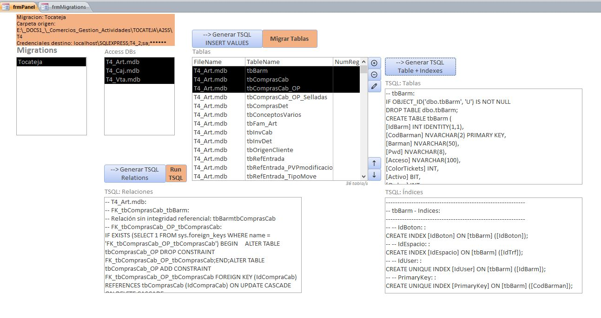

AccessToSQLServer.accdb es una utilidad desarrollada en VBA-Access. 

Sirve para migrar datos desde tablas de bases de datos Access (.mdb, .accdb) a bases de datos SQL Server.

--- Funcionamiento ---

1.- Se crea un registro de Migración en el que definimos la carpeta base donde se situarán lo/s archivos de las bases de datos Access y las credenciales de acceso a la base de dats SQL Server

2.- Se añaden los archivos Access de origen

3.- Se añaden las tablas a migrar

4.- Opcional: se pueden generar las sentencias SQL para Crear las Tablas, Insertar los datos, crear los índices y las relaciones entre tablas.

5.- Opcional: se puede ejecutar la migración sobre las tablas seleccionadas, lo que, ordenadamente, ejecutará la Creación de tablas, Inserción de datos y creación de índices. Posteriormente se podrá generar la SQL de creación de relaciones y/o ejecutar

